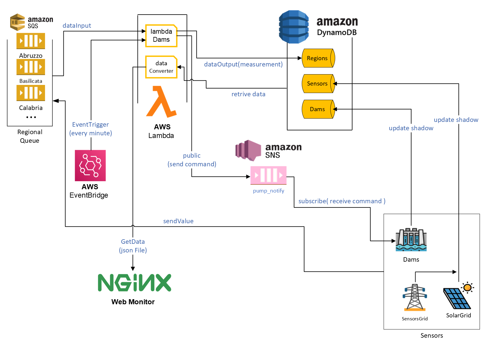

## Context

Nowadays with the growth of energy cost, renewable energy are more important than in the past. The IoT and Serverless can be game-changing for these applications, where geographical distribution of "things"( production point ) is a keyword.
This application implements a system to manage a grid of sensors nationally distribuited, the goal of the project is to balance consumption and production using [energy pumped storage](https://en.wikipedia.org/wiki/Pumped-storage_hydroelectricity). This type of hydroelectricity use dams as "battery", so the main goal is to try to store the excess of production from solar field in dams regionally distribuited, transforming the electricty in potential energy. When the production is lower than consumption the dams try, if it's possible, to produce energy opening the valves and producing energy in more conventional way.

## Architectures


The diagram above show in a simple way how the different services are connected.
All the data and statistics are stored in a noSQL DB with the shadow of the object. The several sensors send data to the reference queue and after, a lambda function "consume" data and elaborate them, if is necessary, the function can trigger the dams (with publish/subscribe pattern) to switch from production or storage mode, or viceversa. All the data, and status can be viewed on a web monitor hosted on nginx server.

## Installation

Clone the repository from github and after create the virtual enviroment of python.
<code>The application is tested on Python v3.10.4</code>
<br>
```bash 
python -m venv ./.venv 
```
Activate the enviroment and install all the requirements.
<br>
```bash
pip install -r requirements.txt
```
<br>

To configure the application, if you are running on Windows or you have installed Powershell on Linux based machine, you can simply run the script named <code>startEnv.ps1.</code> after follow the instruction from [Start emulation of sensor ](#start-emulation-of-sensors)


<br>
<code>N.B you must put all the file of GitHub clone on Desktop, in a folder named DamsSys</code> 

<br>
Otherwise if you are running another sysyem follow the instruction below.

- create a docker container of localstack 
  ```bash
  docker run -p 4566:4566 -p 4510-4559:4510-4559 -d   --name localstack localstack/localstack
  ```
- create a web server for the web monitor 
  ```bash
  docker run --name nginx -v {absolutePathGitCloneFolder}\Web:/usr/share/nginx/html:ro -d -p 8080:80 nginx:stable-alpine
  ```
- Inizialize db and queue
  
  ```bash
    py inizializeDb.py
  ```

  ```bash
  py inizializeQueue.py
  ```

- Define lambdaRole and <code>save the ARN of rule</code>
  ```bash
  aws iam create-role --role-name lambdarole --assume-role-policy-document file://policy/role_policy.json --query 'Role.Arn' --endpoint-url=http://localhost:4566
  ```
- Attach policy to role
  ```bash
  aws iam put-role-policy --role-name lambdarole --policy-name lambdapolicy --policy-document file://policy/policy.json --endpoint-url=http://localhost:4566

  ```
- Zip lambda functions
  ```bash
  zip   dataConverter.py dataConverter.zip
  zip   lambdaDams.py lambdaDams.zip
  ```
  <br>
- Create the lambda function dataConverter
  ```bash
  aws lambda create-function --function-name dataConverter --zip-file fileb://dataConverter.zip --handler dataConverter.lambda_handler --runtime python3.6 --role {insertTheLambdaRoleARN} --endpoint-url=http://localhost:4566
  ```
- Create the lambda function url configuration and <code>save the url</code>
  ```bash
  aws lambda create-function-url-config --function-name dataConverter --auth-type NONE --cors AllowCredentials=true,AllowMethods=*,AllowOrigins=*,AllowHeaders=*,MaxAge=600,ExposeHeaders=* --endpoint-url=http://localhost:4566
  ``` 
- Change the url inside the <code>.\Web\assets\js\init\loadData.js</code> with the new url created before from url configuration of <code>dataConverter</code>
<br>
- Create the lambda function lambdaDams and <code>save the ARN</code>

  ```bash
  aws lambda create-function --function-name lambdaDams --zip-file fileb://lambdaDams.zip --handler lambdaDams.lambda_handler --runtime python3.6 --role {insertTheLambdaRoleARN} --endpoint-url=http://localhost:4566
  ``` 
<br>

- Create the rule to trigger the lambda function lambdaDams and <code>save the ARN of rule</code>
  
  ```bash
  aws events put-rule --name damsRoutine --schedule-expression 'rate(1 minutes)' --endpoint-url=http://localhost:4566
  ```

  ```bash
    aws lambda add-permission --function-name lambdaDams --statement-id actionRoutine --action 'lambda:InvokeFunction' --principal events.amazonaws.com --source-arn {insertTheARNofRule} --endpoint-url=http://localhost:4566
  ```

- Put inside the json file <b>asset/target.json</b> the <code> ARN of lambdaDams function</code> saved before.

<br>

- Set the target of rule 

  ```bash
  aws events put-targets --rule damsRoutine --targets file://asset/target.json  --endpoint-url=http://localhost:4566
  ```
<br>

- Test the correct execution of lambdaDams  

  ```bash
  aws lambda invoke --function-name lambdaDams lambdaDams.txt --endpoint-url http://localhost:4566
  ```

<br>

- <code>N.B if some function dosen't work try to reload the function code</code>

  ```bash
  aws lambda update-function-code --function-name dataConverter --zip-file fileb://dataConverter.zip --endpoint-url=http://localhost:4566
  ```

  ```bash
  aws lambda update-function-code --function-name lambdaDams --zip-file fileb://lambdaDams.zip --endpoint-url=http://localhost:4566
  ```
<br>

## Start emulation of sensors 
 

```bash
py .\startEmulation.py
```

## Launch web monitor

Open you web broswer without the web-security feature.

For example if you are running chrome : 
```bash
 ./chrome.exe --disable-web-security  --user-data-dir={absolutePathTemp} "http://localhost:8080/"
```


